# authwise

> **A trajectory-eval control plane for a multi-step LangGraph agent.** It routes Prior
> Authorization (PA) requests for a fictional payer (*Northfield Health*) through a
> `classify → policy-check → decide` graph — and puts **the path each request takes** — which
> branch fired, how many retry cycles ran — under the engineering control usually reserved for
> answers: versioned, gated in CI, attributed, and alerted on.
> The application is a fixture; **the trajectory is the product.**

<p align="center">
  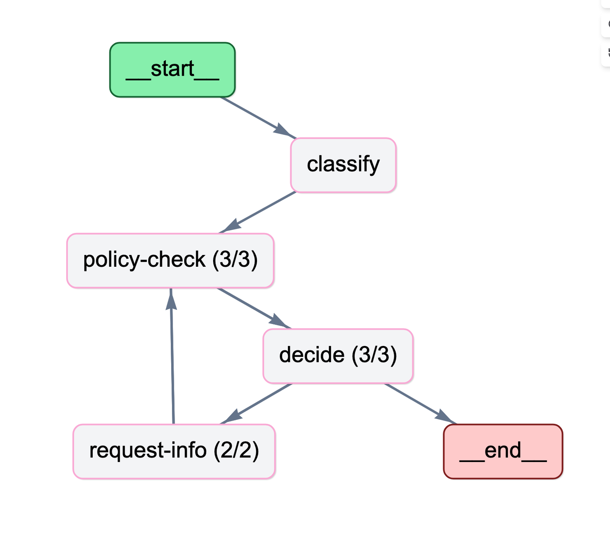
</p>

🧭 the **route is a first-class object** (`PathTrace`) · 📦 golden **trajectories are a versioned
dataset** · 🚦 a **routing regression can't merge** · 💸 cost/latency **attributed to graph
nodes**, alerts **name the slow node** · 🛑 a run that exhausts its budget **escalates as a
route, not an exception** · 📉 **branch-distribution drift** is caught by PSI · 🧬 the prompts
that steer the route are **pinned by a versioned routing-policy** · 🆓 every proof replays
offline for **$0**

**What this demonstrates:** **agent trajectory evaluation** end to end — a trajectory
golden-set, CI path-assertion gates, per-node cost/latency SLOs with alerting, runtime budget
controls, path-distribution drift monitoring, and routing-policy versioning.

📸 **Showcase below** · 🚀 **[Run it](#run-it)** · 🧭 **[Engineering decisions → docs/tech-decisions.md](docs/tech-decisions.md)**

---

## The object of measurement

The graph is small on purpose and frozen — the complexity budget goes into *measuring* the
trajectory, not growing the graph. LLMs live in `classify` and `policy-check`; the `decide`
branching is a deterministic function over policy-check's structured output and the run's
remaining budget:

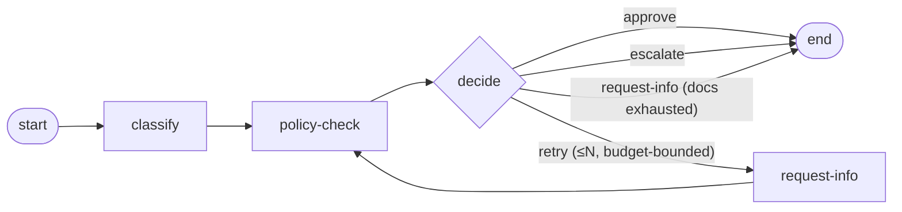

Every run returns a **`PathTrace`** next to the answer — `{branch, retry_cycles, nodes}` — and
that value (not telemetry, not logs) is the single source of truth for every assert below:

```
$ make smoke
PA-smoke-001: classify → policy-check → approve
PA-smoke-002: classify → policy-check → request-info ↻1 → approve
PA-smoke-003: classify → policy-check → escalate
PA-smoke-004: classify → policy-check → request-info ↻2
```

Three terminals plus the retry loop in four lines — note `PA-smoke-004`: it exhausts its
retries without ever getting the missing documents, so the *terminal itself* is
`request-info` (the case stays pended). That distinction — branch × retry count — is exactly
what the rest of this README versions, gates, and monitors.

## The trajectory lifecycle, end to end

| Practice | What is proven | Tool | Proof |
|---|---|---|---|
| **Version** | Trajectory golden-set — expected *paths* as a dataset | MLflow Evaluation Dataset | [🖼](#version--the-golden-set-stores-paths-not-answers) |
| **Gate** | CI path-assertion gate — a routing regression blocks the merge | pytest · GitHub Actions | [🖼](#gate--a-routing-regression-cant-merge) |
| **Attribute** | Per-node cost/latency attribution + Agent Graph | Langfuse (LangGraph integration) | [🖼](#attribute--every-node-has-a-price-and-a-latency) |
| **Guard** | Runtime budget controls — exhaustion is a *route* | deterministic `decide` over remaining budget | [🎞](#guard--budget-exhaustion-is-a-route-not-an-exception) |
| **Alert** | Per-node latency/cost SLO — the alert names the node | Prometheus · Grafana | [🖼](#alert--the-slo-lives-at-node-granularity) |
| **Monitor** | Path-distribution drift — branch shares + PSI | Prometheus · Grafana | [🎞](#monitor--the-distribution-of-routes-drifts-psi-says-when) |
| **Pin** | Routing-policy as a versioned artifact pinning prompt versions | MLflow Registry | [🎞](#pin--the-routing-policy-is-a-versioned-artifact) |

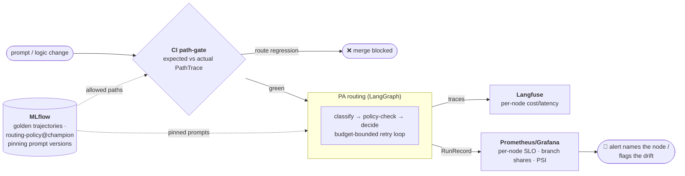

---

# Proof, capability by capability

Every proof below runs in `replay` mode against committed cassettes — **$0, no API key,
deterministic** — via the commands in [Run it](#run-it). Two screenshots (the Langfuse trace
and the SLO dashboard) come from an additional *live* run, so the latencies and dollar costs
you see are real, not replayed zeros.

## Version — the golden-set stores *paths*, not answers

The reference for 30 PA requests lives in MLflow as an **Evaluation Dataset**: inputs are the
requests, **expectations are the allowed trajectories**. The assert is *membership* — the
actual path must be one of the record's allowed paths — rather than exact match against a
single reference, which is the industry norm for trajectory eval (Vertex, LangSmith, agentevals
all support multiple reference trajectories). So that membership never degrades into
"anything goes": **≥80 % of records are singletons** (one allowed path = exact match), and
every multi-path "joker" is named explicitly, with a reason.

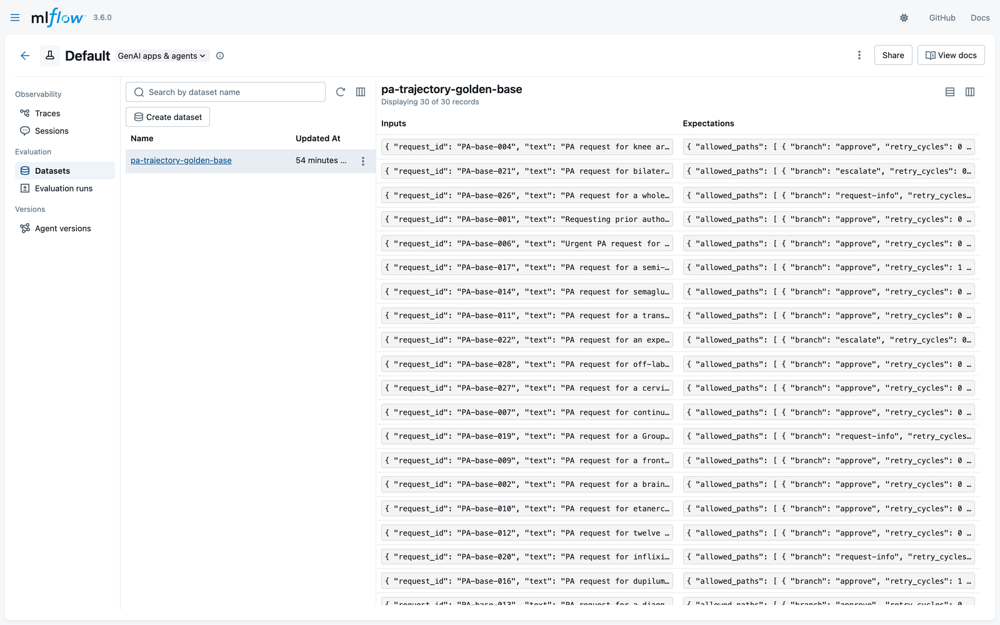

A singleton next to a joker — `PA-base-022` must escalate, period; off-label `PA-base-028` may
legitimately end in `approve` *or* `escalate`, and the gate accepts either:

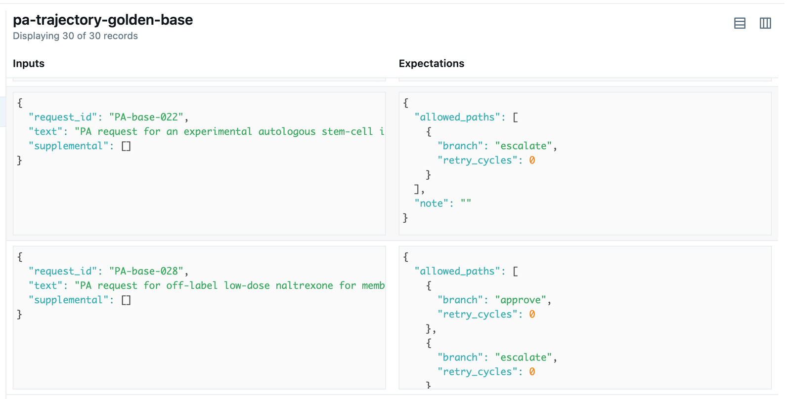

## Gate — a routing regression can't merge

CI replays the golden pack and compares **routes**: `PathTrace` (branch + retry count) against
`allowed_paths`. Here is that gate doing its job on a real PR: the policy-check prompt was
"streamlined" into a rubber stamp (*trust provider documentation by default*), and the PR
ships the re-recorded cassettes — in an offline CI the cassettes *are* the model's behavior.
The answers still parse, the JSON is still valid — **but one request lost its retry loop and
two flipped branches** (`escalate → approve` is exactly the flip a payer cannot afford), the
required `check` went red, and the merge is blocked
([PR #1](https://github.com/DmitryDubovikov/authwise-lite/pull/1), kept open as a demo).

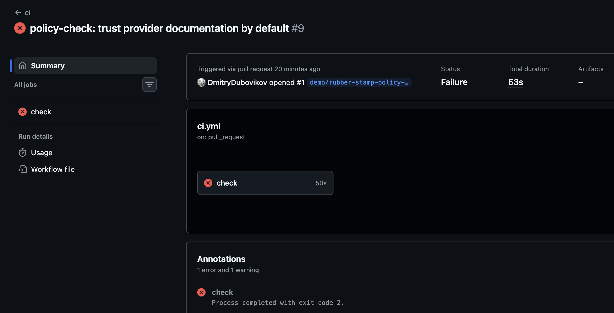

The same gate, locally — the table names each regressed route:

```
$ make path-gate-broken
PA-base-001  ✓ ok          ожид: approve ↻0          факт: approve ↻0
PA-base-015  ✗ REGRESSION  ожид: approve ↻1          факт: approve ↻0
PA-base-019  ✗ REGRESSION  ожид: request-info ↻2     факт: approve ↻0
PA-base-021  ✗ REGRESSION  ожид: escalate ↻0         факт: approve ↻0
────────────────────────────────────────────────────────────────
FAIL — 3 регрессий маршрута
```

A lost retry loop (`↻1 → ↻0`) is exactly the class of bug an answer-quality eval structurally
cannot see: every individual answer looks fine.

## Attribute — every node has a price and a latency

Traces go to **Langfuse** through the LangGraph integration, so the trace *is* the graph: spans
are named by node, every generation carries token usage and dollar cost, and the Agent Graph
view draws the actual route with visit counts (`policy-check (3/3)`, `request-info (2/2)` — the
hero image at the top). Below, a live run of `PA-base-026`: classify at 3.46s/$0.000018, three
policy-check attempts individually priced, and the node's structured verdict
(`missing_info` + rationale) on the right:

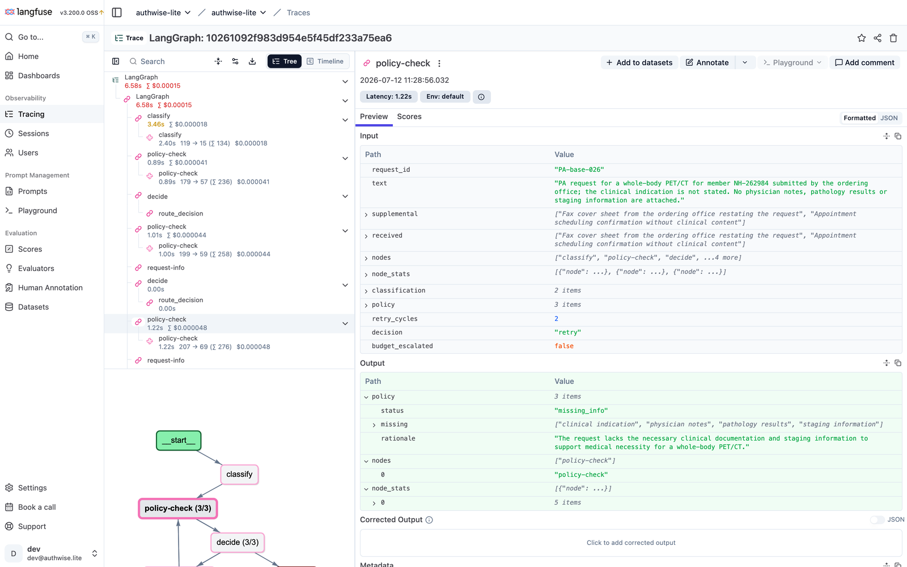

Observability is *attribution only*: the source of truth for asserts stays the domain
`PathTrace`, never the telemetry.

## Guard — budget exhaustion is a route, not an exception

Each run carries a USD budget; the retry loop continues **only while the remaining budget is
positive**. Squeeze the budget via env and the same requests that pended for more documents now
**escalate to a human** — visibly, in the path, tagged `[budget]`. No exception, no silent
truncation; the trajectory itself records the FinOps decision:

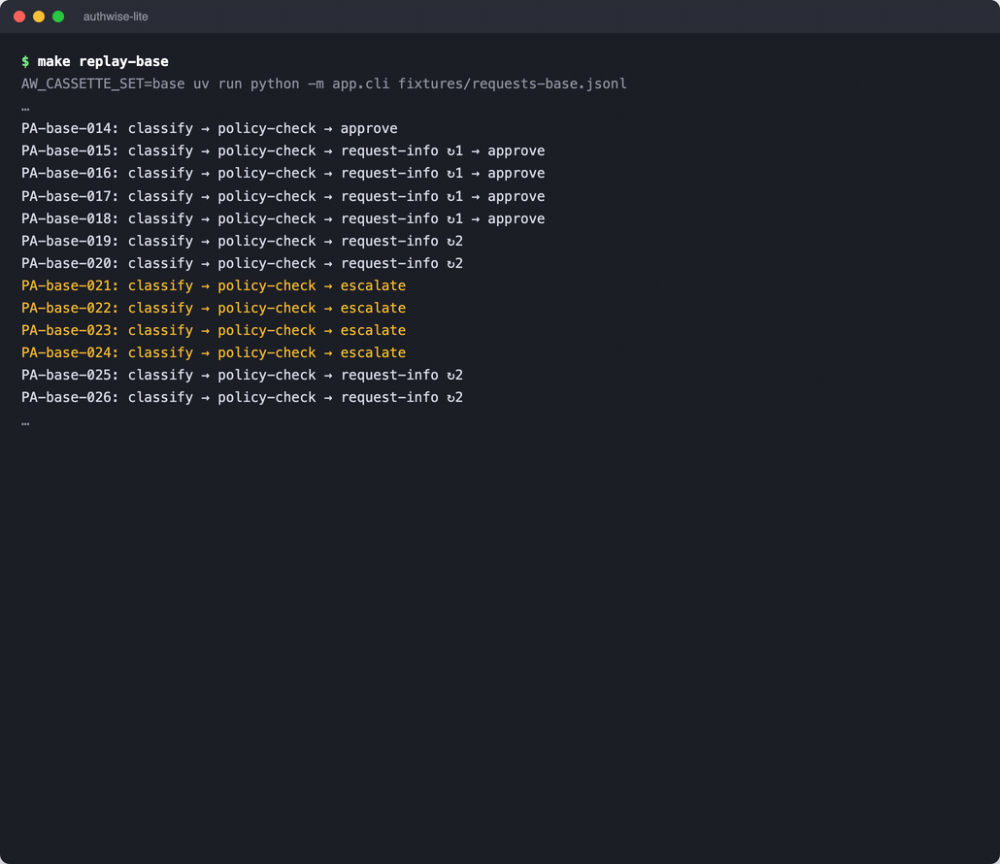

The escalation is also a metric — the batch counter turns red in Grafana:

<p align="center">
  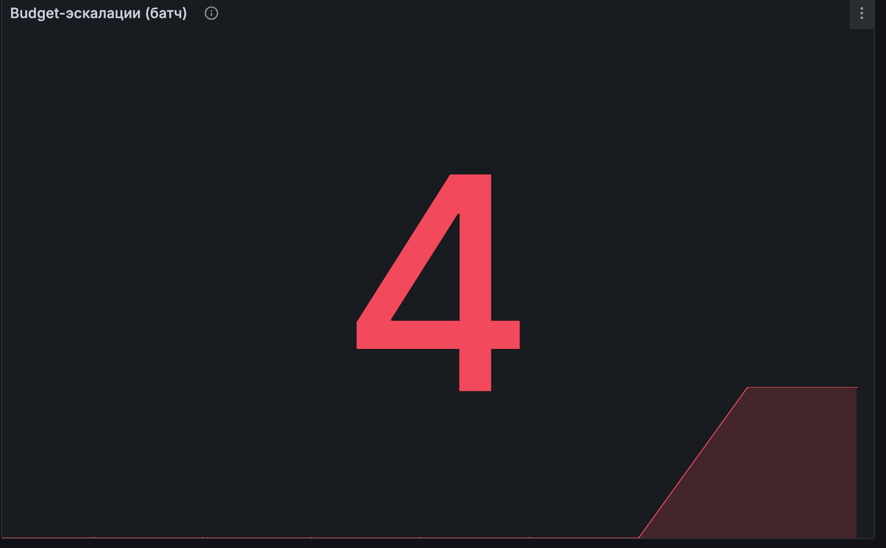
</p>

The default budget is calibrated so golden paths don't change — `make path-gate` stays green;
the guardrail demo is one env var, not a code edit.

## Alert — the SLO lives at node granularity

`RunRecord` aggregates get pushed to **Prometheus** (Pushgateway — the run is a short-lived
batch), and **Grafana** draws the per-node SLO: latency by node, cost by node, calls, budget
escalations. The numbers below are from a real (non-replay) run — classify averages 2.6s,
policy-check 0.8s:

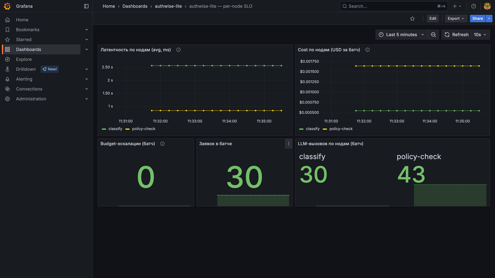

The alert rule is multi-dimensional — one instance per `node` label, so the alert **names the
offender** («нода classify превысила SLO-порог латентности»), with per-node values right in the
rule view:

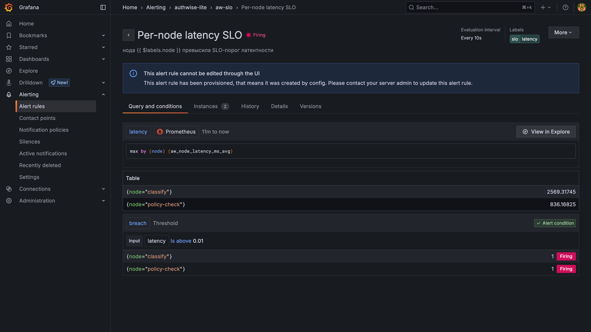

*(One staged element, flagged: the alert threshold is a demo stub — 0.01 ms, anything fires.
The default $0 replay runs have near-zero latencies, so there is no honest corpus to calibrate
an SLO against; in production the threshold comes from live percentiles. The mechanics —
per-node series, multi-dimensional rule, node-naming annotation — are the real thing.)*

## Monitor — the distribution of routes drifts, PSI says when

Answer-drift monitors watch what the model *says*; this watches where the traffic *goes*. Two
packs of requests — the reference one and a "post-release" one with a deliberately shifted case
mix — produce branch-share metrics, and a **PSI** (population stability index) compares the
distributions. PSI = 0.583 against the 0.2 threshold — the alert fires:

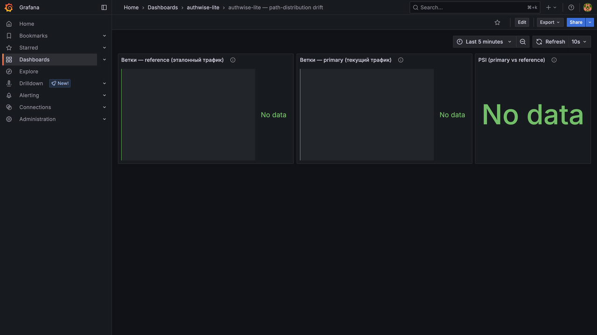

```
$ make drift-push
branch              base      post
approve            73.3%     36.7%
request-info       13.3%     26.7%
escalate           13.3%     36.7%
PSI(post vs base) = 0.583 — значимый (> порога) 0.2
```

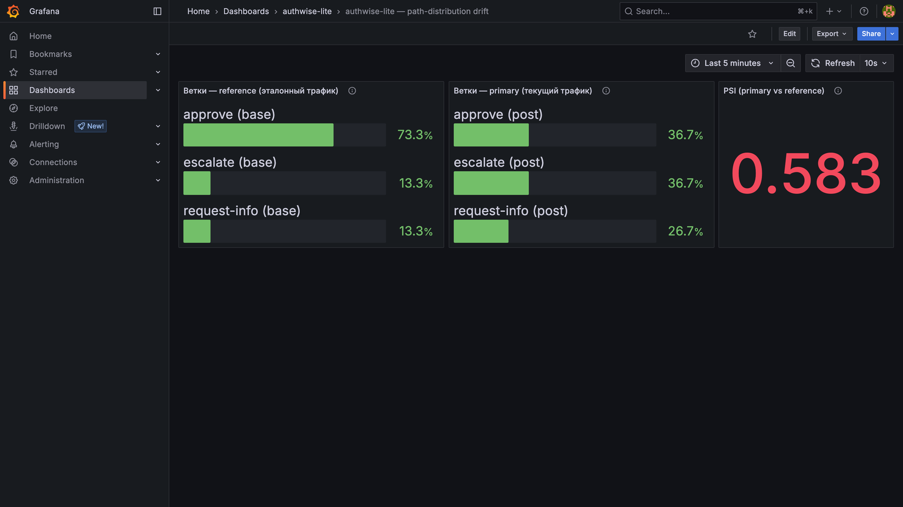

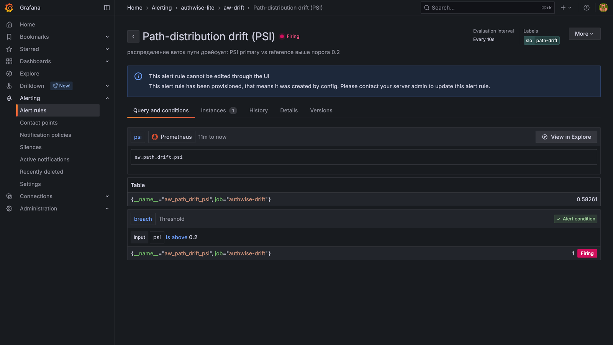

Unlike the latency demo, this threshold is **not** staged: 0.2 is the standard PSI convention,
and the post-release shift (approvals halve, escalations triple) is the kind of change a payer
would genuinely page on.

## Pin — the routing policy is a versioned artifact

The two prompts that steer the route (`pa-classify`, `pa-policy-check`) are versioned in the
MLflow **Prompt Registry**, and a **routing-policy** — a registered model version — **pins the
exact version of each prompt** (MLflow 3 `prompts=` linking, not a hand-rolled bundle). Aliases
make it operational: `champion` is what production loads, `challenger` is the rubber-stamp
fixture from the red PR above, materialized as policy v2:

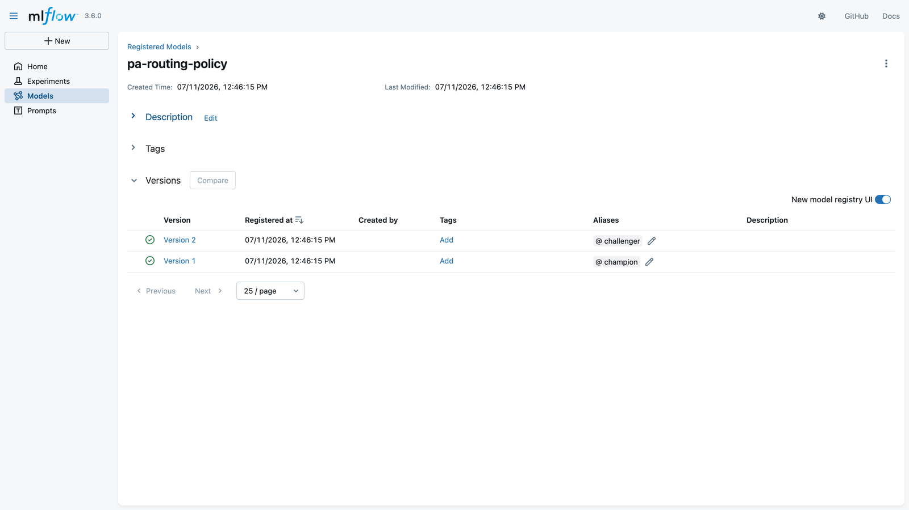

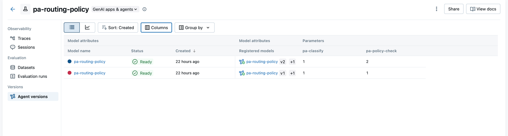

The swap is atomic, verified **from the store** (MLflow API, not the UI), and reversible —
run it twice and you're back where you started:

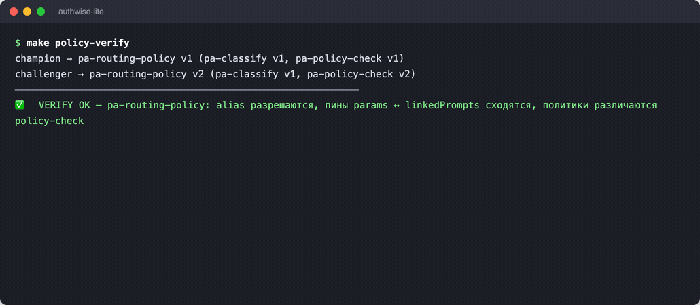

By default the agent still takes prompts from code, so CI and the path-gate stay offline;
loading the pinned `champion` templates from the registry is one env var
(`AW_ROUTING_POLICY_ALIAS=champion`) — and the golden paths stay identical, proving the pinned
templates really reach the graph nodes.

---

## Architecture & seams

Dependencies point one way: **transport → workflow → domain/persistence**. The domain core is
pure functions and Pydantic schemas — `PathTrace`, the golden membership assert, the gate and
budget decisions — with no I/O. `llm/` is cross-cutting (tier router + record/replay cassettes).
OTel/Langfuse spans are observability only; **asserts read the domain `PathTrace`, never
telemetry**.

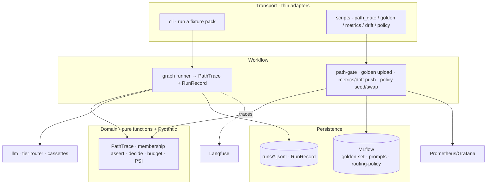

**LiteLLM discipline (a security red line).** SDK-only, never the Proxy; one bare `acompletion`,
no callbacks, telemetry off, lazy import, pinned version + `uv.lock`, keys only via `Settings`.
Models are named only in `llm-tiers.yaml`, each a **dated snapshot** (`-YYYY-MM-DD`,
mechanically enforced). Graph nodes default to the `cheap` tier.

## Relation to the sibling -lite projects

Fifth in the series, and deliberately built from the **same stack** rather than new tools:
[policywise-lite](https://github.com/DmitryDubovikov/policywise-lite) covers architecture + RAG,
[dossier-lite](https://github.com/DmitryDubovikov/dossier-lite) multi-agent orchestration,
[sentiment-mlops](https://github.com/DmitryDubovikov/sentiment-mlops) classic supervised MLOps,
[triagewise-lite](https://github.com/DmitryDubovikov/triagewise-lite) the LLMOps control plane
over a *single call*. authwise reuses their equipment wholesale — the LangGraph pattern and
record/replay cassettes from policywise, MLflow/OTel/Langfuse from triagewise — and points it
at the one thing none of them measures: **the trajectory of a multi-step agent**. The single
new tool is **Prometheus + Grafana**, added for SLO alerting and path-drift — because an SLO
without an alert rule is just a log line.

## Run it

Offline and free by default — cassettes replay recorded outputs, nothing hits the network.

```bash
uv sync --extra dev
cp .env.example .env               # defaults are fine for offline use

make smoke                         # route the smoke pack, print the paths        ($0)
make check                         # ruff + mypy + pytest, incl. the path-gate    ($0)

# Gate: trajectory regression testing
make path-gate                     # golden pack — expected vs actual, exit 0
make path-gate-broken              # rubber-stamp policy-check → gate goes RED

# Version: the golden-set in MLflow
make up                            # MLflow at :5051
make golden-upload golden-verify   # land the dataset; verify FROM the store

# Attribute: per-node cost/latency in Langfuse
make obs-up                        # Langfuse at :3001 (dev@authwise.lite / lite-password)
make trace-base langfuse-verify    # traced replay; verify spans/cost FROM the store

# Guard + Alert: budget controls and per-node SLO in Grafana
make slo-up                        # Prometheus :9090 · Grafana :3002 (admin / lite-password)
make budget-demo                   # squeezed budget → "… → escalate  [budget]"
make metrics-push slo-verify       # per-node metrics; alert rule Firing, from the API

# Monitor: path-distribution drift
make replay-base replay-post       # RunRecords for both packs
make drift-push drift-verify       # branch shares + PSI=0.583; alert Firing

# Pin: routing-policy versions
make policy-seed policy-verify     # prompts + pinning policy versions + aliases
make policy-swap                   # atomic champion ↔ challenger (run twice = undo)
make replay-base-champion          # pinned templates from the registry; paths unchanged

make down                          # stop everything
```

`AW_LLM_MODE=replay` is the default. `record`/`live` hit OpenAI and cost money (the whole
project fits in a few dollars) — gated behind an explicit go. All env goes through `Settings`
with the `AW_` prefix.

## What this puts on a résumé

- *Built a **trajectory-eval control plane** for a multi-step LangGraph agent: a versioned
  trajectory golden-set and routing-policy versions pinning per-node prompt versions (MLflow),
  CI path-assertion gates that block merges on routing regressions (branch + retry-count), and
  path-distribution drift monitoring with PSI-based alerting (Prometheus/Grafana).*
- *Attributed cost/latency SLOs to individual graph nodes (agent-level LLM FinOps) via
  OpenTelemetry — per-node dashboards in Langfuse, SLO alerting in Prometheus/Grafana — and
  enforced runtime budget controls: a cost-bounded retry loop with budget-exhaustion
  escalation.*

`Agent trajectory evaluation · trajectory golden-set · CI path-assertion gates · per-node
cost/latency SLO · runtime budget controls · path-drift monitoring (PSI) · LangGraph · MLflow ·
Prometheus/Grafana` — *the same equipment as the sibling projects, applied to a new object of
measurement: the path.*
